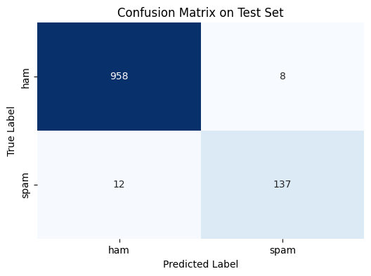

# ML Model Deployment: Spam Classifier API with Flask, Docker, and CI/CD

## Project Overview

This project demonstrates the end-to-end process of building a Machine Learning model and deploying it as a containerized web API with integrated SQL logging and an automated CI/CD pipeline. The project focuses on text classification for Spam detection.

## Problem Statement

Effectively identifying and filtering spam messages is crucial for managing digital communication. This project aims to build an automated system that can predict whether a given message is spam, accessible via a standard web API for integration into applications or services.

## Dataset

* **Name:** SMS Spam Collection Dataset
* **Source:** Available on Kaggle (https://www.kaggle.com/uciml/sms-spam-collection-dataset).
* **Content:** Contains a collection of SMS messages labeled as 'ham' (not spam) or 'spam'.
* **Size:** Contains 5572 messages, split into training and testing sets (80/20 split).
* **Challenge:** The dataset has a significant class imbalance, with many more 'ham' messages than 'spam' messages.

## Methodology

This project integrates several components to create a deployable ML service:

1.  **ML Model Development:**
    * Loaded and preprocessed the SMS message data.
    * Used **TF-IDF Vectorization** to convert message text into numerical features (5000 features).
    * Trained a **Logistic Regression** model using scikit-learn, incorporating `class_weight='balanced'` to address class imbalance during training.
    * Saved the trained model, the TF-IDF vectorizer, and the label encoder using `joblib`.
2.  **Flask API Development:**
    * Created a Python Flask application (`app.py`).
    * The app loads the saved ML model and vectorizer into memory on startup.
    * Defined a `/predict` **REST API endpoint** that accepts POST requests with a JSON body containing the message text (e.g., `{"message": "Your text"}`).
    * The API uses the loaded model to preprocess the input message, make a prediction, and return a JSON response with the predicted label ('ham' or 'spam') and the prediction probabilities.
3.  **SQL Logging:**
    * Integrated **SQLite** database logging into the Flask API.
    * For each incoming prediction request, the API logs the original message, predicted label, and probabilities into a `predictions` table in a `prediction_logs.db` file.
4.  **Dockerization:**
    * Created a `Dockerfile` to package the Flask application, saved ML model files, the Python environment, and all dependencies (`requirements.txt`).
    * The Docker image provides a portable and consistent environment for running the API.
5.  **Git and Gitlab:**
    * Used **Git** for version control to track code changes.
    * Hosted the project repository on **Gitlab.com**.
6.  **CI/CD Pipeline (Gitlab CI):**
    * Configured a Continuous Integration/Continuous Deployment pipeline using **`.gitlab-ci.yml`**.
    * The pipeline automatically triggers whenever code is pushed to the `main` branch.
    * The pipeline includes a job that performs both the **`docker build`** (creating the Docker image) and **`docker push`** (sending the image to the Gitlab Container Registry) within the same execution, ensuring the image is available for deployment.

## Results

The trained Logistic Regression model achieved strong performance on the test set:

* **Test Accuracy:** **0.9821**
* **Confusion Matrix:**
    * True Ham, Predicted Ham (TN): 958
    * True Ham, Predicted Spam (FP): 8 (Low false alarms)
    * True Spam, Predicted Ham (FN): 12 (Successfully identified most spam)
    * True Spam, Predicted Spam (TP): 137
* **Classification Report:**
    * **Spam Precision:** 0.94 (Out of messages predicted as spam, 94% were actually spam)
    * **Spam Recall:** 0.92 (The model found 92% of all actual spam messages)
    * Spam F1-score: 0.93

These metrics indicate a highly effective spam classifier with a good balance of minimizing false alarms while still catching most spam.

## Evaluation Metrics Explained

* **Accuracy:** Overall proportion of correct predictions.
* **Confusion Matrix:** Breakdown of correct (True Positives/Negatives) and incorrect (False Positives/Negatives) predictions for each class.
* **Precision:** Accuracy specifically within the set of *predicted* positive cases. Important for minimizing false alarms (especially for spam).
* **Recall (Sensitivity):** Proportion of actual positive cases that were correctly identified. Important for not missing positive cases (especially for spam).
* **F1-score:** Harmonic mean of Precision and Recall, providing a single score that balances both.

## Live Demo

A live version of this Spam Classifier API is deployed and publicly accessible.

* **Platform:** Render.com (using the Free Tier)
* **URL:** `https://spam-classifier-api-qsr3.onrender.com`
    * *(Note: The base URL may change if you rename the Render service; always use the URL provided by Render).*
* **Access Method:** Send a **POST** request to the `/predict` endpoint with JSON data containing your message. The full prediction endpoint URL is `https://spam-classifier-api-qsr3.onrender.com/predict`.

You can test the live API using `curl` (or `Invoke-WebRequest` in PowerShell) or a simple Python `requests` script.

**Example using `curl` (from a standard terminal like Git Bash):**

```bash
Invoke-WebRequest -Uri https://spam-classifier-api-qsr3.onrender.com/predict -Method POST -Headers @{"Content-Type"="application/json"} -Body '{"message": "Claim your prize now!"}'
```

**Example using PowerShell Invoke-WebRequest:**
```bash
curl -X POST -H "Content-Type: application/json" -d '{"message": "Claim your prize now!"}' [https://spam-classifier-api-qsr3.onrender.com/predict](https://spam-classifier-api-qsr3.onrender.com/predict)
```

**Important Considerations (Due to Free Tier):**

Cold Starts: The service may "sleep" after a period of inactivity.
No Persistent Database: The SQLite log data is not persistent across deployments or container restarts on the Free tier.

## Code and Repository

The full project code, `Dockerfile`, and CI/CD configuration (`.gitlab-ci.yml`) are hosted on Gitlab:

* **Gitlab Repository:** [**Link to Your Gitlab Repository** - Replace with your actual Gitlab Repository URL]
* **Model Training Notebook:** `Spam_Classifier_Model.ipynb` (The Colab notebook used for initial model training and saving).
* **API Code:** `app.py` (The Python Flask application).
* **Docker Configuration:** `Dockerfile`
* **Dependencies:** `requirements.txt`
* **CI/CD Pipeline:** `.gitlab-ci.yml`

You can pull and run the Docker image directly from the Gitlab Container Registry on any machine with Docker installed:

```bash
docker pull [registry.gitlab.com/ashirghassan/spam-classifier-api:latest](https://registry.gitlab.com/ashirghassan/spam-classifier-api:latest)
```
Then, run the container, mapping the port:

```bash
docker run -p 5000:5000 [registry.gitlab.com/ashirghassan/spam-classifier-api:latest](https://registry.gitlab.com/ashirghassan/spam-classifier-api:latest)
```

## Dependencies

Key Python libraries and frameworks used:

* `Flask`
* `scikit-learn`
* `joblib`
* `pandas`
* `sqlite3`
* `matplotlib`
* `seaborn`
* `Pillow`

## Visualizations

* **Confusion Matrix on Test Set:**
    
    
---

## Challenges and Learnings

* Successfully integrated different components: ML model, Flask API, SQL database, Docker, and CI/CD pipeline using Gitlab.
* Gained practical experience with Dockerizing a Python application and setting up an automated build/push workflow.
* Addressed the challenge of evaluating models on imbalanced datasets and choosing appropriate metrics (Precision, Recall, F1).
* Learned about deploying containerized applications to a cloud platform (Render.com) and the considerations for free-tier services and persistence.

---
